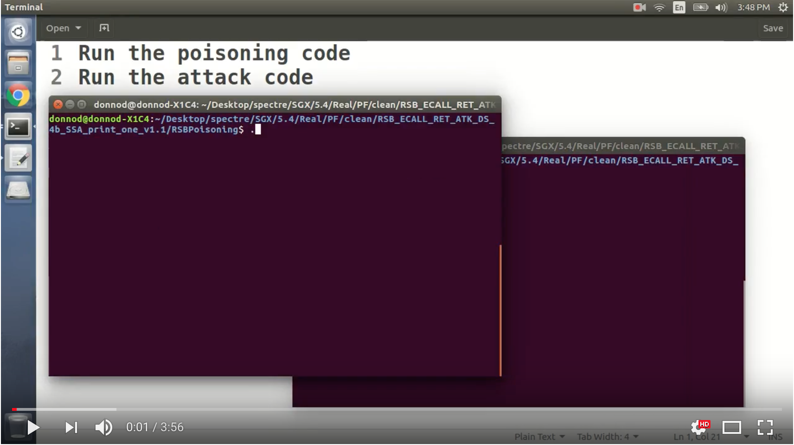

# SgxPectre Attacks
Practical Spectre attacks against Intel's SGX enclaves.

## Overview 
SgxPectre Attacks resulted from a research project conducted by security researchers at The Ohio State University.  The study systematically explores the insecurity of Intel SGX due to branch target injection attacks and micro-architectural side-channel attacks. The research is one of a series of [research projects](http://web.cse.ohio-state.edu/~zhang.834/projects/sgx-side-channels.html) on SGX side channels  in which OSU researchers have been involved.

Software Guard eXtensions (SGX) is a hardware extension available in recent Intel processors.  SGX provides software applications shielded execution environments, called *enclaves*, to run private code and operate sensitive data, where both the code and data are isolated from the rest of the software systems. Even privileged software such as the operating systems and hypervisors are not allowed to directly inspect or manipulate the memory inside the enclaves.  There are already commercial cloud platforms that utilize SGX to offer customers trustworthy computing environments.

However, it has already been demonstrated that by observing execution traces of an enclave program left in the CPU caches, branch target buffers, DRAM's row buffer contention, page-table entries, and page-fault exception handlers, a side-channel adversary with system privileges may *infer* sensitive data from the enclaves. These traditional side-channel attacks are only feasible if the enclave program already has secret-dependent memory access patterns.

SgxPectre Attacks are a new type of side-channel attacks against SGX enclaves.
But the consequences of SgxPectre Attacks are far more concerning. We show that SgxPectre Attacks can completely compromise the confidentiality of SGX enclaves. In particular, because vulnerable code patterns exist in most SGX runtime libraries (e.g., Intel SGX SDK, Rust-SGX, Graphene-SGX) and are difficult to  be eliminated, the adversary could perform SgxPectre Attacks against *any* enclave programs. We demonstrate end-to-end attacks to show that the adversary could learn the content of the enclave memory, as well as its register values in such attacks. 

## Research papers
* [SgxPectre Attacks: Leaking Enclave Secrets via Speculative Execution](https://arxiv.org/abs/1802.09085), *Guoxing Chen, Sanchuan Chen, Yuan Xiao, Yinqian Zhang, Zhiqiang Lin, Ten H. Lai*, Feb. 2018.

## What is the exploited vulnerability
Similar to their non-SGX counterparts, SgxPectre attacks exploit the race condition between the injected, speculatively executed memory references and the latency of the branch resolution. Two hardware features enable SgxPectre attacks:
* The branch prediction units used in the enclave mode for predicting branch targets are not thoroughly cleansed upon enclave entrance. Therefore, code outside the targeted enclave (either running in the unprotected memory region or in another enclave) can manipulate the targets the branch prediction inside the targeted enclave.
* Implicit caching caused by speculatively executed instructions are not properly rolled back after these instructions are discarded, which means the speculatively executed instructions, though never committed to memory, may lead to cache state changes that are observable by the adversary.

## What is the condition of practical exploitation
In order to exploit the hardware vulnerability, two types of code patterns are required in the enclave code:
* The first type of code patterns consists of a branch instruction that can be influenced by the adversary and several registers that are under the adversary's control when the branch instruction is executed. 
* The second type of code patterns consists of two memory references sequentially close to each other that collectively reveal some enclave memory content through cache side channels. 

##  Who is vulnerable
Because there are vulnerable code patterns inside the SDK runtime libraries, any code developed with Intel's official SGX SDK will be impacted by the attacks. *It doesn't matter how the enclave program is implemented.*

We also studied a few other runtime libraries in the [paper](https://arxiv.org/abs/1802.09085); such vulnerable code patterns are very common.

## What are the solutions
Our [empirical evaluation](https://arxiv.org/abs/1802.09085) on a patched Skylake processor (i5-6200U) suggests that Indirect Branch Restricted Speculation (IBRS) can effectively address SgxPectre attacks. IBRS restricts the speculation of indirect branches. By default, on machines that support IBRS, branch prediction inside the SGX enclave cannot be controlled by software running outside. 

However, since existing SGX processors need to apply microcode updates to support IBRS and the microcode patch can be reverted by a system administrator easily, enclave owners have to completely trust the system administrators of the SGX-enabled platform. *It means the current SGX-enabled processors do not provide any security guarantee against a dishonest (cloud) service provider or a malicious insider.*

Therefore, we developed a software tool to automatically scan enclave programs and search for vulnerable code patterns. The detail of the tool can be found in our [paper](https://arxiv.org/abs/1802.09085).  

## Demo
In this demo, we show that SgxPectre attacks can read the the GPRSGX region of the State Save Area (SSA) after an AEX of the targeted enclave. Because the register values inside the enclave are stored in the SSA region, every register can be read by the SgxPectre attacks.
 

## Open-source code
The source code of the project has two components: 
* The SgxPectre attack code: userspace programs and kernel patches that work together to extract secrets from enclaves. 
* The vulnerability scanning tool: an extension of [Angr](https://github.com/angr/angr) that automatically identify vulnerable code patterns in enclave programs via symbolic execution. 

We plan to open source the SgxPectre attack code later. But the symbolic execution tool is released here first to help the SGX developers to identify vulnerable code patterns in their own applications. 

## People
The research has been conducted by the following researchers at The Ohio State University:
* Faculty members: *Yinqian Zhang, Zhiqiang Lin, Ten H. Lai*
* Graduate students: *Guoxing Chen, Sanchuan Chen, Yuan Xiao*

## Reponsible disclosure
We have disclosed our study to Intel before releasing the research paper. 
